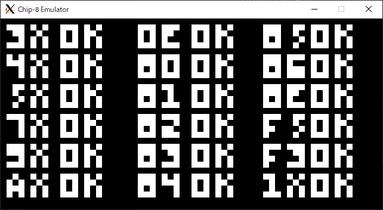
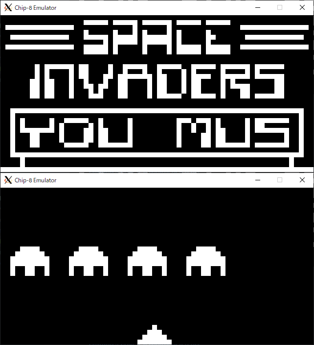

# chip8-emulator

Chip-8 Emulator written in Rust.

## Run

```
cargo run <path-to-chip8-rom>
```

## Gallery

### chip8-test-rom

https://github.com/corax89/chip8-test-rom



### space-invaders

https://github.com/kripod/chip8-roms/blob/master/games/Space%20Invaders%20%5BDavid%20Winter%5D.ch8



## TODO

* fix bugs when running some ROMs.

## References

* [mattmikolay/chip-8](https://github.com/mattmikolay/chip-8)
* [Cowgod's Chip-8 Technical Reference](http://devernay.free.fr/hacks/chip8/C8TECH10.HTM)
* [Awesome CHIP-8](https://chip-8.github.io/links/)
* [kripod/chip8-roms](https://github.com/kripod/chip8-roms)
* [Writing NES Emulator in Rust](https://bugzmanov.github.io/nes_ebook/chapter_1.html)
